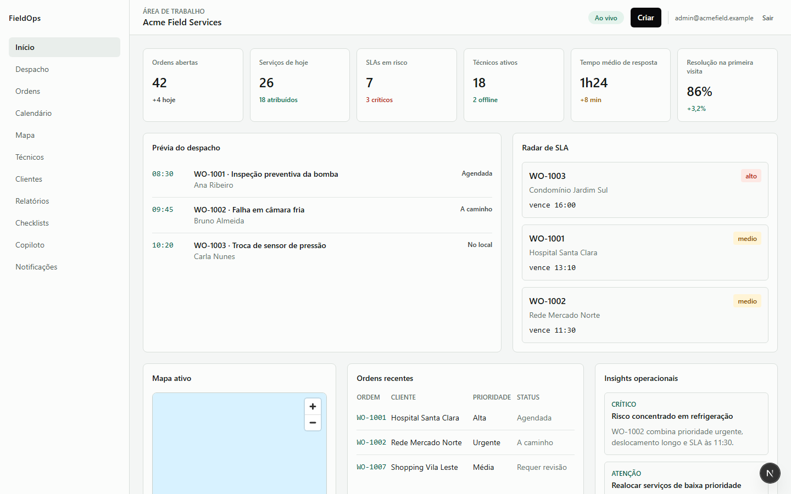
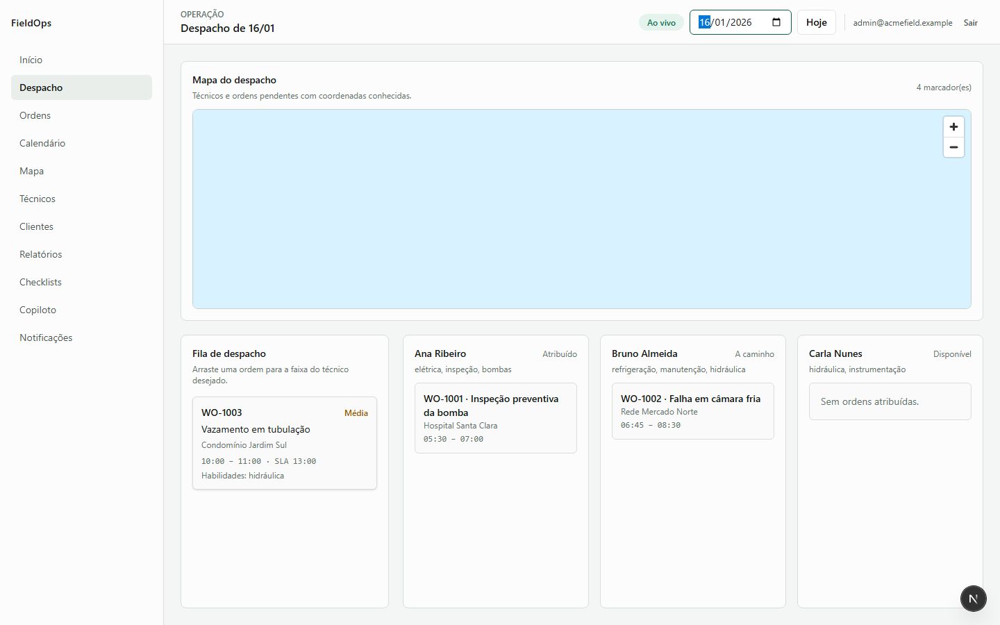
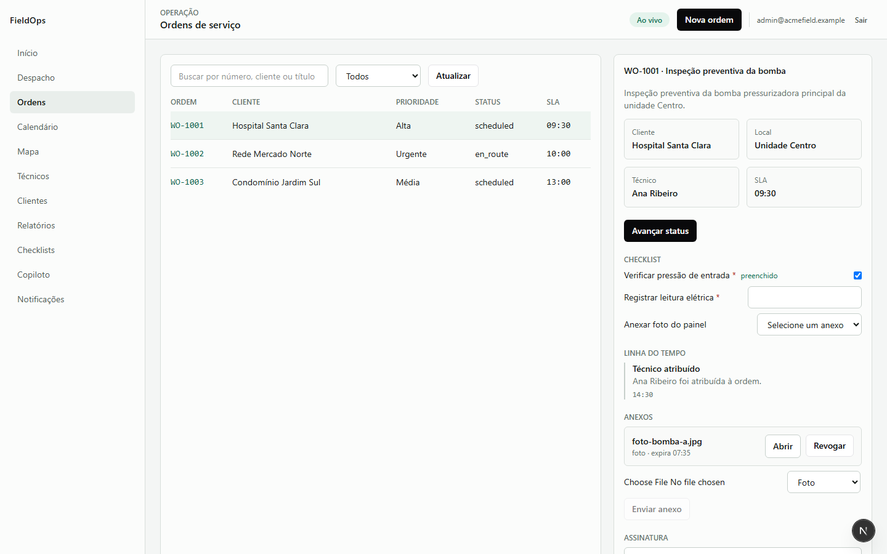
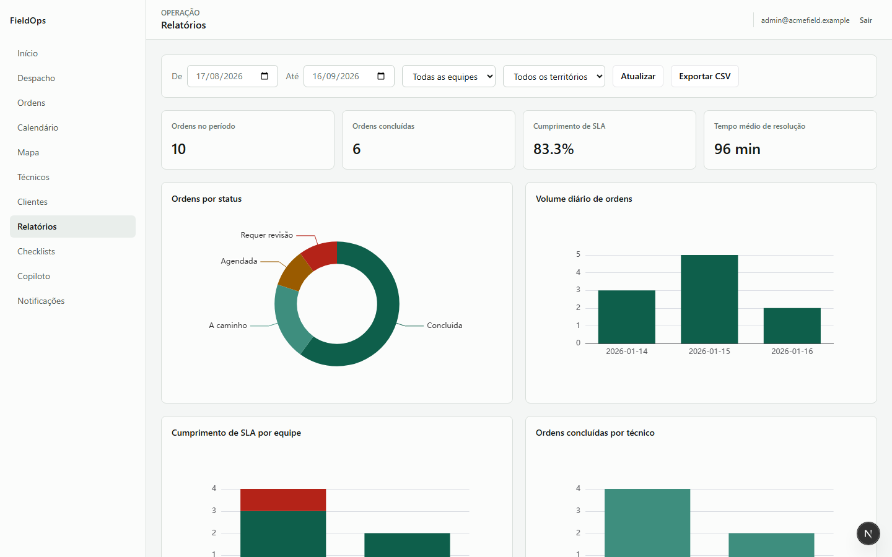
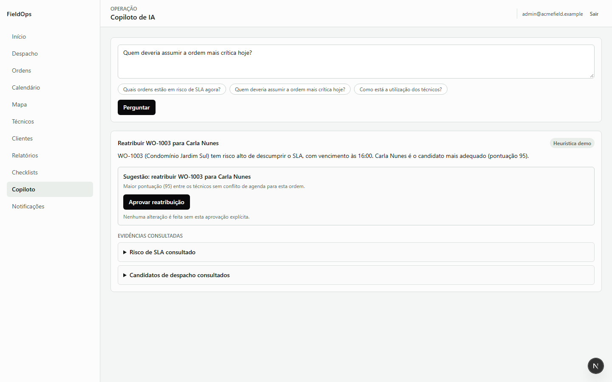

# FieldOps

FieldOps é uma plataforma de operações de serviços em campo (field service management): despacho de técnicos com mapa, ordens de serviço com checklist e assinatura digital, cadastro de clientes/locais/ativos, relatórios operacionais, notificações e eventos em tempo real, e um copiloto de IA que sugere reatribuições com base em risco de SLA — sempre com aprovação humana explícita.

É um projeto de portfólio construído em público, fase a fase, com um monorepo pnpm/Turborepo full-stack (NestJS + Next.js + Postgres/Drizzle) e disciplina de testes (Vitest + Playwright) desde o início. O histórico de decisões e limitações conhecidas de cada fase está em [`docs/`](docs) e [`docs/backlog.md`](docs/backlog.md).

## Principais funcionalidades

- **Login real com RBAC** — sessão via token assinado, permissões e escopo de equipe/território resolvidos do Postgres (com fallback demo determinístico quando não há banco configurado).
- **Painel Início** — KPIs, prévia de despacho, radar de SLA, mapa de serviços ativos e insights operacionais, atualizados em tempo real via SSE.

  

- **Despacho com mapa e drag-and-drop** — arraste uma ordem não atribuída para a faixa de um técnico; a pontuação do candidato (habilidades, território, conflito de agenda, deslocamento estimado) aparece durante o arraste. O mapa (MapLibre) plota a localização ao vivo dos técnicos e as ordens pendentes.

  

- **Ordens de serviço** — checklist com validação de formato (min/max, regex), upload de anexos com URL assinada e revogação manual, assinatura do cliente, notas editáveis, trilha de auditoria e atualização otimista.

  

- **Clientes, locais, contatos, contratos e ativos** — CRUD completo (criar/editar/remover com soft-delete), busca por nome, território e contrato ativo.
- **Relatórios** — KPIs, cumprimento de SLA por equipe, volume diário, utilização de técnicos, exportação em CSV.

  

- **Copiloto de IA** — usa a Groq (`openai/gpt-oss-120b`, free tier) com ferramentas somente leitura e loop de tool-use; sem chave configurada, cai em um caminho heurístico determinístico. Nunca reatribui uma ordem sozinho — toda ação sugerida exige aprovação explícita do usuário.

  

- **Autoria de checklist** — administrador monta/edita campos de um template de checklist (tipo, obrigatoriedade, validação) e publica novas versões.
- **Técnico offline (`apps/mobile-web`)** — checklist, notas e assinatura por canvas funcionam offline e sincronizam ao voltar a conexão; fila de sincronização com retry.
- **Tempo real** — eventos de status/atribuição/localização via SSE, consumidos em Início, Despacho e Ordens.
- **Notificações**, **auditoria** com filtro por ator/período, e **health checks** de liveness/readiness.

## Stack

| Camada | Tecnologia |
| --- | --- |
| API | NestJS, Postgres (Drizzle ORM), Redis (ioredis), Zod |
| Web (desktop) | Next.js, TanStack Query, MapLibre GL, ECharts, dnd-kit |
| Web (técnico) | Next.js, IndexedDB (fila offline) |
| IA | Groq SDK, com fallback heurístico determinístico |
| Testes | Vitest (unitário/integração), Playwright (E2E) |
| Infra de referência | Neon (Postgres), Upstash (Redis + Blob), Vercel, Render — todos com camada gratuita |

Monorepo gerenciado com pnpm workspaces + Turborepo:

- `apps/web` — shell desktop (despacho, ordens, clientes, relatórios, checklists, copiloto, notificações).
- `apps/mobile-web` — shell do técnico em campo, com suporte offline.
- `apps/api` — API NestJS (um módulo por domínio: auth, dispatch, work-orders, customers, reports, realtime, copilot, notifications, attachments, checklist-templates, sync, health, admin, maps).
- `packages/database` — schema Drizzle, migrações, seed demo, fábricas de conexão Postgres/Redis.
- `packages/domain` — regras de negócio puras (transições de status, pontuação de despacho, validação de checklist) sem dependência de infraestrutura.
- `packages/auth`, `packages/types`, `packages/ui`, `packages/maps`, `packages/ai`, `packages/sync`, `packages/integrations` — fronteiras tipadas compartilhadas entre API e front-ends.

## Como rodar

A infraestrutura de referência usa apenas serviços com camada gratuita: [Neon](https://neon.tech) (Postgres), [Upstash](https://upstash.com) (Redis e Blob para anexos), [Vercel](https://vercel.com) (`apps/web` e `apps/mobile-web`), [Render](https://render.com) (`apps/api`) e [Groq](https://groq.com) (copiloto de IA). Nada disso é obrigatório para desenvolver — sem Postgres configurado, a API roda inteiramente em modo demo (dados determinísticos em memória, mesmo contrato de API).

1. Instale as dependências:

   ```bash
   pnpm install
   ```

2. Copie o template de ambiente:

   ```bash
   cp .env.example .env
   ```

3. (Opcional) Preencha `DATABASE_URL` com a connection string do Neon e `REDIS_URL` com a `rediss://` do Upstash. Sem isso, a API usa o modo demo automaticamente.

4. Rode os apps:

   ```bash
   pnpm dev
   ```

   - Web (desktop): http://localhost:3000
   - Mobile web (técnico): http://localhost:3001
   - API: http://localhost:4000

### Login demo

Com ou sem Postgres configurado, os três usuários demo funcionam (senha `demo1234`):

| Papel | Email |
| --- | --- |
| Administrador | `admin@acmefield.example` |
| Despachante | `ana@acmefield.example` |
| Técnico | `bruno@acmefield.example` |

### Alternativa: infraestrutura local via Docker

Para quem preferir não depender de contas externas durante o desenvolvimento, `docker-compose.yml` sobe um Postgres e um Redis locais equivalentes:

```bash
docker compose up -d
```

Nesse caso, use os valores padrão de `DATABASE_URL`/`REDIS_URL` já presentes em `.env.example` (apontando para `localhost`), rode as migrações (veja [Banco de Dados](#banco-de-dados)) e o seed demo.

### Variáveis opcionais

Todas têm fallback determinístico quando ausentes — nenhuma é obrigatória para desenvolver ou demonstrar o produto.

| Variável | Efeito quando configurada |
| --- | --- |
| `CORS_ALLOWED_ORIGINS` | Origens web/mobile autorizadas a chamar a API com cookie de sessão. |
| `NEXT_PUBLIC_API_BASE_URL` | URL pública da API usada pelos apps web/mobile. |
| `MAPS_PROVIDER_BASE_URL` | Estimativa de rota real via OSRM no despacho (em vez do adaptador mock). |
| `CALENDAR_PROVIDER` | Habilita bloqueios externos de calendário no despacho; hoje aceita `mock`. |
| `GROQ_API_KEY` | Copiloto usa o modelo real da Groq (em vez do caminho heurístico). |
| `NEXT_PUBLIC_MAPTILER_KEY` | Tiles reais do MapTiler no mapa (em vez do estilo público sem chave). |
| `UPSTASH_BLOB_TOKEN` | Anexos vão para o Upstash Blob (em vez de disco local). |

O roteiro de deploy gratuito está em [`docs/deploy-free-tier.md`](docs/deploy-free-tier.md).

## Verificação

```bash
pnpm verify   # lint + typecheck + testes (Vitest) de todos os pacotes
pnpm e2e      # testes end-to-end (Playwright)
```

Endpoints de saúde da API: `GET /health` (liveness) e `GET /health/readiness` (ping em Postgres e Redis).

## Banco de Dados

O schema Drizzle fica em `packages/database/src/schema.ts`.

```bash
pnpm --filter @fieldops/database db:generate   # gerar migração após alterar o schema
pnpm --filter @fieldops/database db:migrate    # aplicar migrações em DATABASE_URL
pnpm --filter @fieldops/database seed:demo     # popular dados demo determinísticos
```

## Estado do projeto

FieldOps foi desenvolvido em mais de 30 fases incrementais, cada uma documentada em `docs/phase-N-report.md` (ou `docs/roadmap-fase-NN-*-report.md` para o roadmap original de 17 fases). O que ainda está em aberto — e por quê — está consolidado em [`docs/backlog.md`](docs/backlog.md), incluindo itens conscientemente adiados (ex.: pub/sub multi-instância, ciclo de vida completo de usuários) e validações que só fazem sentido em ambiente real com credenciais de produção.
